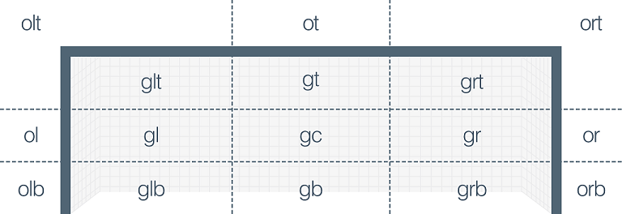

# Pitt Soccer Analytics App

Welcome! 

This app is designed to provide insight about collegiate soccer through the use of visual plots and tables that summarize key statistics.

## How to use the App

### Uploading Data
First the app needs data to analyze. To upload data:
1. Navigate to the tab labelled **Upload JSON** in the top row.
2. Click on the box labelled **Browse...** on the lefthand side of the page
3. Select the Wayscout Event level data JSON file that contains the game(s) that you would like to analyze.
4. There should be a blue bar under the **Browse...** button that says "Upload complete", along with information in the "Games in upload" section on the right; If so, that indicates that the data has been successfully uploaded into the app.

With the data uploaded now you can use the other tabs in the top row of the app to view the data in different ways.

## Tabs

### Pass Analysis
#### Probability Heatmap Function
This function is designed to analyze and visualize where passes start and end in the form of a heatmap that represents different areas of the soccer field. 

The algorithm can show the pass occurances of each half (e.g. `1H` means first half) games separately, and this plot also can show occurances combination by selecting on the tab.

#### Football Passing Network Map
This page generates a table that summarizes the information regarding passes from the provided data. It can display:
1. **passAttempts**:  The total number of passes attempted by players.
2. **successfulPasses**: The number of passes that successfully reached a teammate.
3. **failedPasses**: The number of passes that did not reach a teammate or were intercepted by the opposition.
4. **player**：Player who started the pass.
5. **recipient**: Player who recieved the pass. 

#### Probability Heatmap Function
This function is designed to analyze and visualize scoring probabilities based on shot locations, particularly focusing on shots made during a game. The visualization is in the form of a heatmap that represents different areas of the soccer field.

The algorithm combines the scoring probabilities of all games in a single dataset to ensure the greatest confidence in the probability of scoring at different position of the field.

1. **Heatmap Generation**: Utilizes ggplot2 to create a heatmap. Each tile's color intensity represents the scoring probability for that area, with the color gradient ranging from low (blue) to high (red) scoring probabilities.
2. **Aesthetics and Labels**: The heatmap includes a color scale to indicate scoring probabilities, minimalistic theme styling, and a title.
3. **Reactivity**: The heatmap updates reactively to changes in the input data, ensuring that the visualization always reflects the current dataset.

The output of this function is a heatmap visualization that provides insight into which areas of the playing field have higher or lower probabilities of scoring. This information can be crucial for teams and coaches to develop strategies, train players, and analyze opponents' defensive weaknesses.

###  Shot Information Table
This page generates a table that summarizes the information regarding shots from the provided data. It can display:
1. **shotAttempts**: The number of shots attempted
2. **shotsOnTarget**: The number of shots that were actually on goal
3. **actualGoals**: The number of goals scored
4. **xg**: The expected number of goals scored
5. **difference**: The difference between the expected goals and the actual goals (xg - actual)

The user can decide whether these columns are calculated for each player or each team in the provided data, although a player/team must register at least one shot attempt to be included. 

The checkboxes on the left hand side of the screen give the ussr this control. Any box checked under **Information Categories** will have the corresponding column presented, and the selected option, either “Player” or “Team”, under **Present Information by Player or by Team** will determine the grouping. 

Users can also sort the resulting table by any of the columns by simply clicking on the column name at the top. 

This table is useful because it presents all the information in one location, allowing the user to quickly determine what players/team are shooting the most, scoring the most, who is expected to score the most, who may be over/under performing in terms of scoring, etc. 

### Shot Location Visualization
This page generates plots that provide another method for the user to visualize the location of shots. The user has control over the groupings used, as well as the coloring and shapes of the data points. They also have the option to have all of the shots that resulted in goals be circled, for increased clarity.

The user changes the plots using the dropboxes on the lefthand side of the screen.
1. **Select the first Category to group by**: Indicates what variable should be grouped by first. If both grouping options are selected, this variable will appear
on the y-axis (vertically)
2. **Select the second Category to group by**: Indicates what variable should be grouped by second. If both grouping options are selected, this variable will appear
on the x-axis (horizontally)
3. **Select the variable that controls the color**: Indicates what variable controls the color of the data points. For example, if "Team" is selected, then all shots taken by Team A will be in one color, while all shots taken by Team B will be in a different color.
4. **Select the variable that controls the shape**: Indicates what variable controls the shape of the data points. For example, if "Team" is selected, then all shots taken by Team A will be one shape, while all shots taken by Team B will be a different shape.

The Legend for color and shape will appear to the right of the plot(s), once the options in question are selected.

*Note*: If neither grouping option is selected there will only be one plot. Also, it is possible to select "None" for the first group option and pick a real variable
for the second, in that case the variable selected second, will be treated as though it was selected first.

**Should goals be circled?**: If "Yes" is selected then all shots that resulted in goals will be circled. If "No" is selected then all shots will remain uncircled.

The variable options are as follows for each of the dropboxes:
1. **None**: This will leave the given dropbox option blank.
2. **Match Period**: Represents what part of the game the shot took place during. Includes the halves and extra time.
3. **Body Part**: What part of the body the shot was taken with.
4. **Shot is Goal**: Indicates whether or not the shot resulted in a goal.
5. **Shot on Target**: Indicates whether or not the shot was on target.
6. **Team Name**: The name of the team that took the shot.
7. **Player Name**: The name of the player that took the shot.
8. **Goal Zone**: Represents where the shot went on goal.

The following image shows a breakdown for **Goal Zone**:

This page provides users with options regarding how to view the data along with ways to break down the data spatially to identify trends and other patterns.
